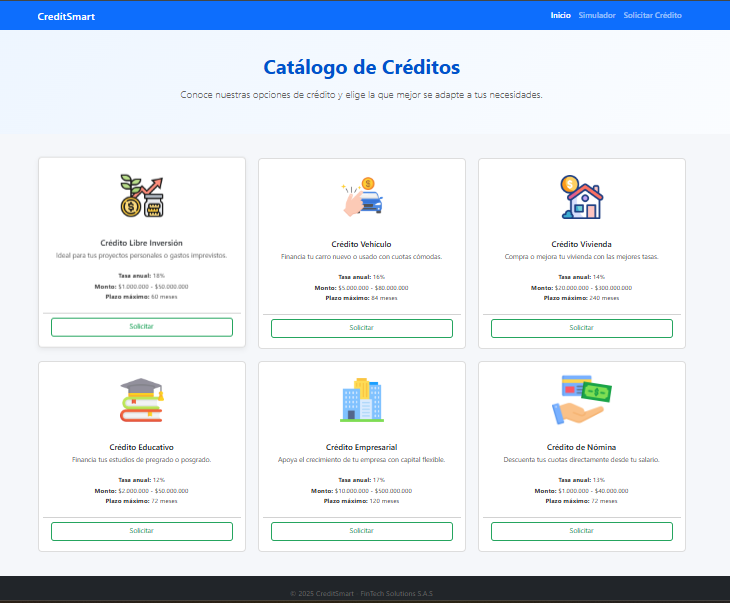
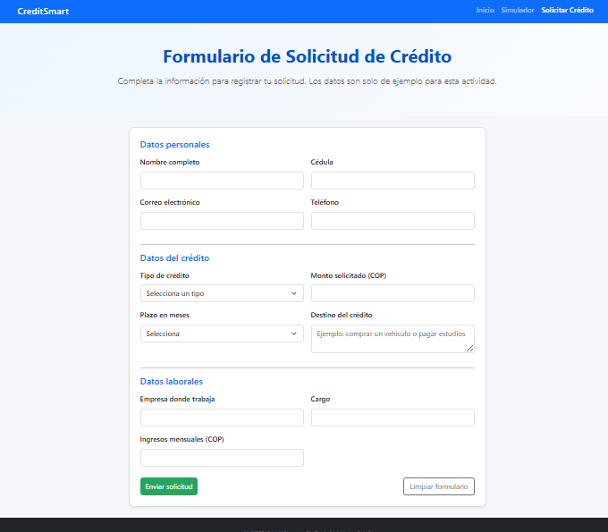

# 💳 CreditSmart - Sistema de Gestión de Solicitudes de Crédito

**Nombre del estudiante:** Laura Vanessa García Agudelo  
**Asignatura:** Ingeniería Web I  
**Actividad:** Diseño de Interfaces Web – CreditSmart  
**Año:** 2025

---

## 🧩 Descripción del proyecto

**CreditSmart** es una aplicación web estática desarrollada en html con estilos css y bootstrap con el fin de garantizar que sea responsive en cualquier interfaz de usuario final. En el diseño también se utilizaron colores acordes a la industria y a la teoría del color, que permitan al usuario visualizar una página agradable y fluida. 
Simula la interfaz de una plataforma financiera que permite:

- Consultar un catálogo de productos crediticios.
- Filtrar opciones en un simulador visual.
- Diligenciar una solicitud de crédito en línea.

---

## 🗂️ Estructura de archivos

``` CreditSmart/
│
├── index.html # Página principal - Catálogo de créditos
├── simulador.html # Página de búsqueda / simulador visual
├── solicitar.html # Página del formulario de solicitud
│
├── css/
│ └── styles.css # Estilos personalizados (colores, cards, formularios)
│
├── img/
│ ├── credito-libreinversion.png
│ ├── credito-carro.png
│ ├── credito-vivienda.png
│ ├── credito-educacion.png
│ ├── credito-empresarial.png
│ └── credito-nomina.png
│
└── README.md # Documentación del proyecto
```


## ⚙️ Instrucciones para ejecutar el proyecto

1. **Descargar o clonar** este repositorio en un computador.
2. Abrir la carpeta `CreditSmart/`.
3. Hacer **doble clic** sobre el archivo `index.html` para visualizar el sitio en el navegador.

## Capturas de pantalla

### Página principal - Catálogo de Créditos


### Simulador de Créditos


### Formulario de Solicitud


## 🎨 Créditos de imágenes e íconos

Los íconos utilizados en este proyecto fueron descargados desde  
[Flaticon](https://www.flaticon.com/), creados por diferentes autores, los cuales se citan el footer de las diferentes páginas como parte de la atribución que debe realizarse a sus autores. 
---

## 🧱 Tecnologías utilizadas

- **HTML5** — estructura semántica y accesible.  
- **CSS3** — diseño y personalización de estilos.  
- **Bootstrap 5 (CDN)** — framework para diseño responsive.  
- **Git / GitHub** — control de versiones y documentación del proyecto.
